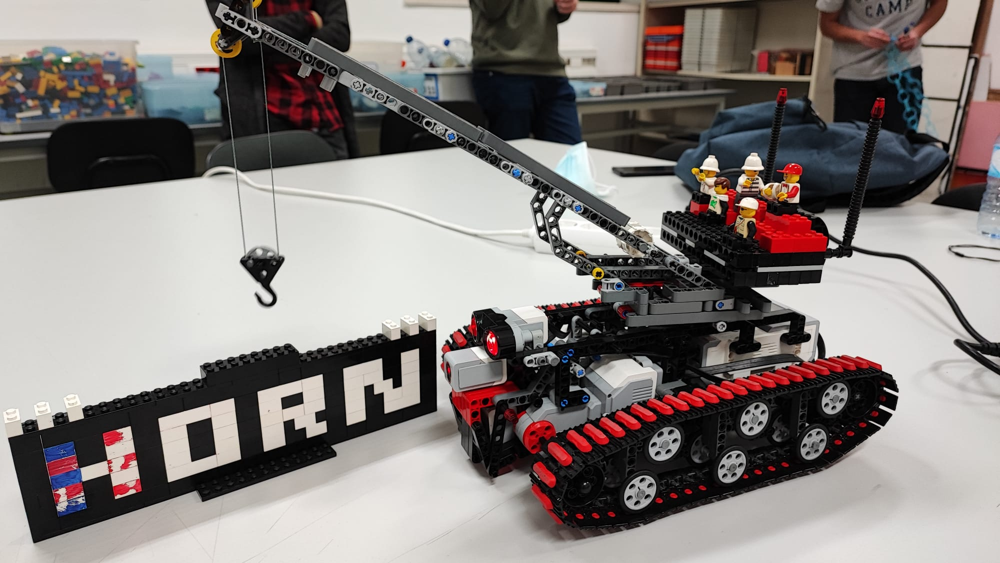

Horn was a robot designed, built and programmed for the Artificial Intelligence class.
Graded in 19.0/20.

# Video of Horn playing the game

# Heuristics
- Horn always saves a minimum of 350 energy each turn, until he has killed 4 enemies (or they ran out of attacks).
  
- If at least 4 enemies can be found on the battlefield dead (or out of attacks), Horn starts using its crane to attack the enemy with more health points.

- If at least 4 enemies can be found on the battlefield dead (or out of attacks), and the remaining two enemies both have 50 health points, Horn attacks both with a sound attack.

- Horn always prioritizes any artilleries he finds on the battlefield, attacking all with a sound attack, even if attacking all of them leaves Horn with less than 350 energy.

- After attacking the artilleries, Horn attacks any remaining enemies with a sound attack until he has 350 energy.

- After attacking the artilleries, if there is only one enemy left, and Horn has enough energy, Horn uses its crane to attack that enemy.

- If 2 or more enemies can be found on the battlefield, Horn attacks them with a sound attack until he has 350 energy.

- If only 1 enemy can be found on the battlefield, Horn attacks that enemy with a sound attack if the enemy has 50 health points, or with a headbutt if the enemy has more than 50 health points.

- Horn regains energy if he has less than 500 energy, and there aren't 4 enemies dead or out of attacks.

